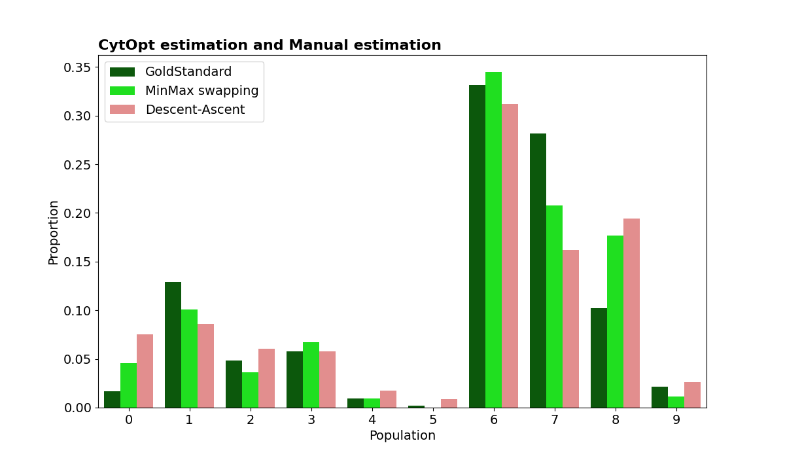
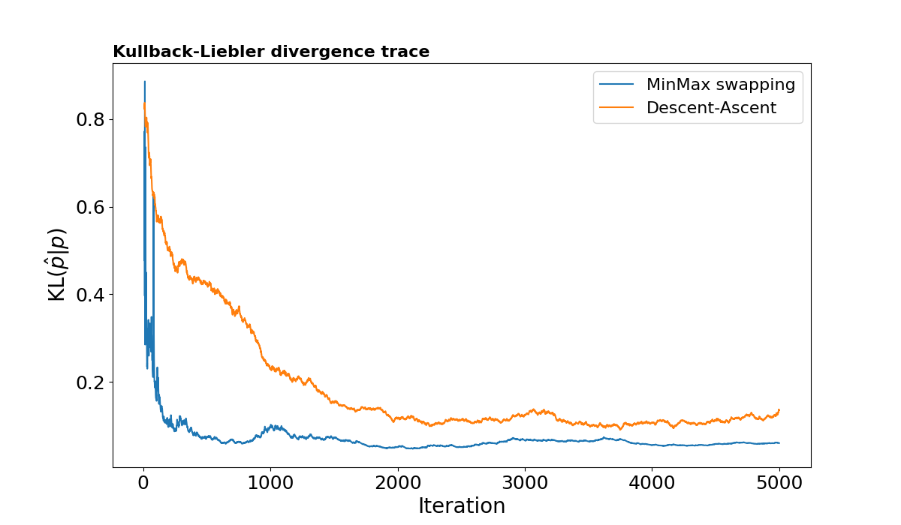
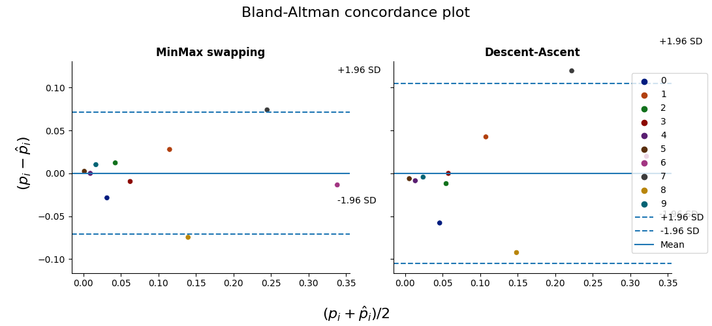
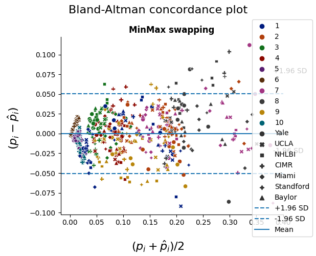

# `CytOpT` <a></a>
[](https://sistm.github.io/CytOpT-python/_build/html/index.html)

`CytOpT` uses regularized optimal transport to directly estimate the different cell population proportions from a biological sample characterized with flow cytometry measurements.


## Overview
`CytOpT` is a `python` package that provides a new algorithm relying regularized 
optimal transport to directly estimate the different cell population proportions 
from a biological sample characterized with flow cytometry measurements. Algorithm 
is based on the regularized Wasserstein metric to compare cytometry measurements 
from different samples, thus accounting for possible mis-alignment of a given cell 
population across sample (due to technical variability from the technology of measurements).

The main function of the package is `CytOpT()`.

The methods implemented in this package are detailed in the following
article:

> Paul Freulon, Jérémie Bigot, Boris P. Hejblum.
> CytOpT: Optimal Transport with Domain Adaptation for Interpreting Flow Cytometry data
> https://arxiv.org/abs/2006.09003

## Getting started

Install the `CytOpT` package from pypi as follows:

```
pip install -r requirements.txt
pip install CytOpT # pip3 install CytOpT
```

## Example

### Packages

```
import numpy as np
import pandas as pd
import CytOpT.CytOpt as cytopt
import CytOpT.plots as cplt
```


### Preparing data

```
# Source Data
Stanford1A_values = pd.read_csv('./tests/data/W2_1_values.csv',
                                usecols=np.arange(1, 8))
Stanford1A_clust = pd.read_csv('./tests/data/W2_1_clust.csv',
                               usecols=[1])

# Target Data
Stanford3A_values = pd.read_csv('./tests/data/W2_7_values.csv',
                                usecols=np.arange(1, 8))
Stanford3A_clust = pd.read_csv('./tests/data/W2_7_clust.csv',
                               usecols=[1])
                               
xSource = np.asarray(Stanford1A_values)
xTarget = np.asarray(Stanford3A_values)                               
labSource = np.asarray(Stanford1A_clust['x'])
labTarget = np.asarray(Stanford3A_clust['x'])

thetaTrue = np.zeros(10)
for k in range(10):
    thetaTrue[k] = np.sum(labTarget == k + 1) / len(labTarget)

```
### Comparison of methods

#### Steps
 - Classification using optimal transport with reweighted proportions. 
 - The target measure  𝛽  is reweighted in order to match the weight vector  ℎ̂   estimated with  𝙲𝚢𝚝𝙾𝚙𝚝.
 - Approximation of the optimal dual vector u. In order to compute an approximation of the optimal transportation plan, we need to approximate  𝑃𝜀 .
 - Class proportions estimation with `𝙲𝚢𝚝𝙾pT()` 
   - Descent-Ascent procedure (`method="desasc"`)
   - Minmax swapping procedure (`method="minmax"`)

```
# Initialization of parameters

nItGrad = 5000
nIter = 10000
nItSto = 10
pas_grad = 10
eps = 0.0001
monitoring = True

# Run Minmax and Desasc
res = cytopt.CytOpT(xSource, xTarget, labSource,thetaTrue=thetaTrue, 
                    method="both", nItGrad=nItGrad, nIter=nIter, nItSto=nItSto, 
                    stepGrad=pas_grad, eps=eps, monitoring=monitoring)
    
# CytOpT Minmax with default params               
cytopt.CytOpT(xSource, xTarget, labSource, thetaTrue=thetaTrue, method='desasc')

# CytOpT Desasc with default params   
cytopt.CytOpT(xSource, xTarget, labSource, thetaTrue=thetaTrue, method = 'minmax')
```
#### Plot all results
 - ***KLPlot***: Display a bland plot in order to visually assess the agreement between CytOpt estimation
    of the class proportions and the estimate of the class proportions provided through manual gating.
 - ***barPlot***: Display a bland plot in order to visually assess the agreement between CytOpt estimation
    of the class proportions and the estimate of the class proportions provided through manual gating.
 - ***BlandAltman***: Display a bland plot in order to visually assess the agreement between CytOpt estimation
    of the class proportions and the estimate of the class proportions provided through manual gating.
 
```
cplt.resultPlot(res, n0=10, nStop=min(nItGrad, nIter))
```



```
cplt.BlandAltman(res['proportions'])
```



#### Bland Altman with Class and Center

```
# CytOpt estimation
Estimate_Prop = pd.read_csv('./tests/data/Res_Estimation_Stan1A.txt',
                                index_col=0)
# Benchmark estimation
True_Prop = pd.read_csv('./tests/data/True_proportion_Stan1A.txt',
                            index_col=0)
True_Prop = True_Prop.drop(['Baylor1A'])
Estimate_Prop = Estimate_Prop.drop(['Baylor1A'])
Estimate_Prop = np.asarray(Estimate_Prop)
True_Prop = np.asarray(True_Prop)
Classes = np.tile(np.arange(1, 11), 61)
Centre_1 = np.repeat(['Yale', 'UCLA', 'NHLBI', 'CIMR', 'Miami'], 10)
Centre_2 = np.repeat(['Standford', 'Yale', 'UCLA', 'NHLBI', 'CIMR', 'Baylor', 'Miami'], 10)
Centre = np.hstack((Centre_1, Centre_2, Centre_2, Centre_2,
                        Centre_2, Centre_2, Centre_2, Centre_2, Centre_2))

props = pd.DataFrame({'GoldStandard': True_Prop.ravel(), 'minmax': Estimate_Prop.ravel()})

cplt.BlandAltman(props, Class=Classes, Center=Centre)

```



#### [You can also look at some other examples with notebooks.](./tests/notebooks/Scripts)